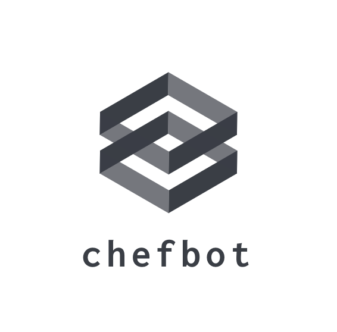

<!-- PROJECT LOGO -->
<br />
<div align="center">
  <a href="https://github.com/oattao123/chefbot.git">
    
  </a>

  <h3 align="center">chefbot</h3>

  </p>
</div>


<!-- TABLE OF CONTENTS -->
<details>
  <summary>Table of Contents</summary>
  <ol>
    <li>
      <a href="#about-the-project">About The Project</a>
      <ul>
        <li><a href="#built-with">Built With</a></li>
      </ul>
    </li>
    <li>
      <a href="#getting-started">Getting Started</a>
      <ul>
        <li><a href="#installation">Installation</a></li>
      </ul>
    </li>
    <li><a href="#contact">Contact</a></li>

  </ol>
</details>


<!-- ABOUT THE PROJECT -->
## About The Project

This project is made for cooks to be more convenient in cooking and easy to use.

<!-- Built With -->
### Built With

* Python
* Docker

<!-- GETTING STARTED -->
## Getting Started

This is an example of how you may give instructions on setting up your project locally.
To get a local copy up and running follow these simple example steps.

### Prerequisites

This is an example of how to list things you need to use the software and how to install them.


### Installation

_You must have local python  docker and  git then you can do this._

1. Clone the repo
   ```sh
   git clone https://github.com/oattao123/chefbot.git
   ```
2. Install docker 
   ```sh
   cd chefbot
   docker build -t pychef .
   ```
3. Running docker
   ```sh
   docker run pychef
   ```


<!-- CONTACT -->
## Contact

Project Link: [https://github.com/oattao123/chefbot.git](https://github.com/oattao123/chefbot.git)


